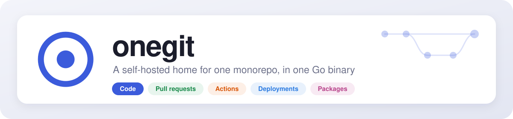
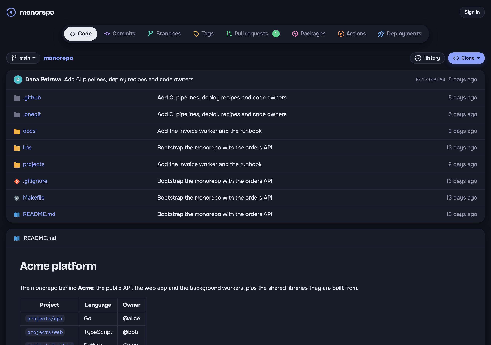
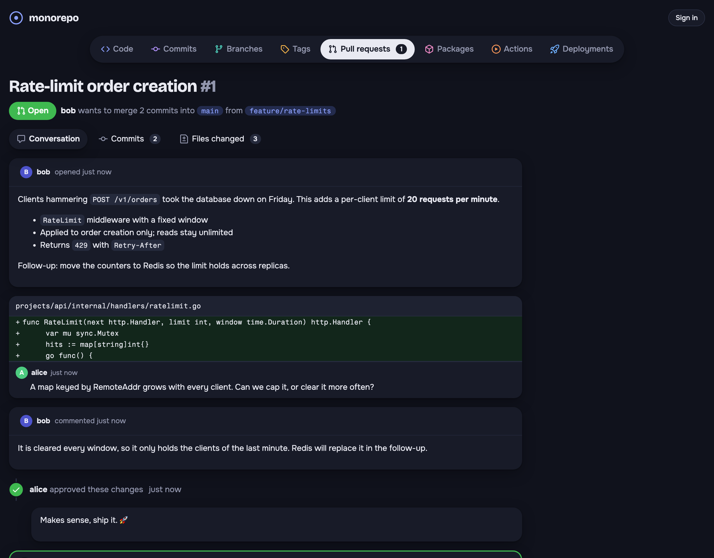
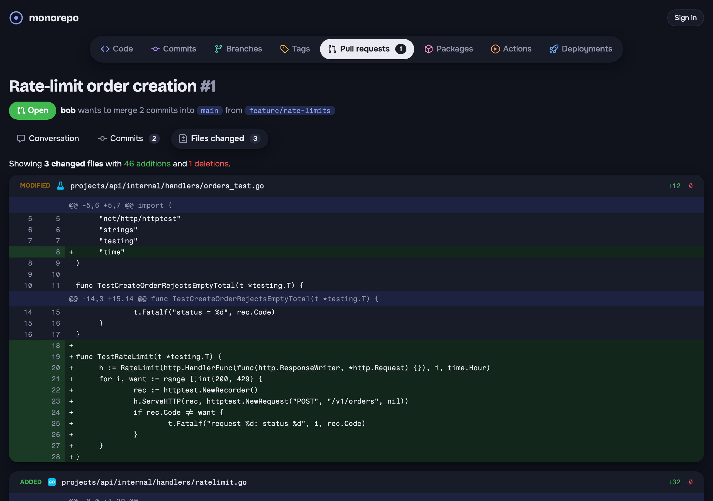
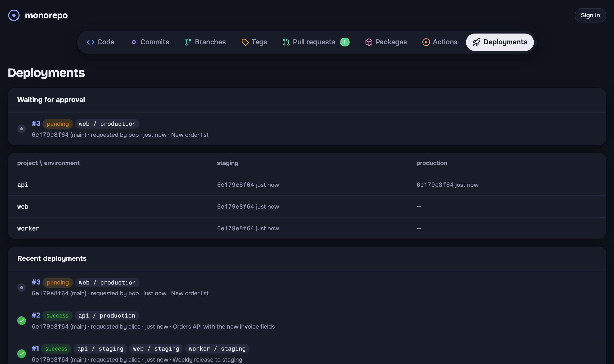

<p align="center">
  
</p>

<p align="center">
  <a href="https://github.com/emmtvv/onegit/actions/workflows/ci.yml"></a>
  <a href="https://hub.docker.com/r/emmtvv/onegit"></a>
  <a href="go.mod"></a>
  <a href="LICENSE"></a>
</p>

<p align="center">
  <b><a href="https://hub.docker.com/r/emmtvv/onegit">Docker Hub</a></b> &nbsp;·&nbsp;
  <b><a href="docs/quickstart.md">Quickstart</a></b> &nbsp;·&nbsp;
  <b><a href="docs/configuration.md">Configuration</a></b> &nbsp;·&nbsp;
  <b><a href="docs">Docs</a></b>
</p>

<p align="center">
  A self-hosted git server for teams that keep everything in <b>one monorepo</b>:<br>
  code browsing, pull requests, CI, policy-driven deployments and a container<br>
  registry, without the weight of a multi-repository forge.
</p>

<p align="center">
  
  
  
  
</p>

## Why

Forges are built for thousands of repositories: organisations, forks, per-repo
settings, per-repo permissions. A company with one monorepo needs none of
that, but it does need what forges are weak at:

- **Deployments nobody can bypass.** In most CI systems anyone who can edit a
  workflow file can deploy anything anywhere. In onegit, pipelines from the
  repository only build and test and never see secrets. Deploying is a
  separate request checked on the server against rules that live in the
  database: who may deploy which project to which environment, from which
  branch, with which approvals, and only images that CI built from that very
  commit.
- **One small thing to run.** One Go binary, stateless apart from the git
  repository. Postgres, Redis and S3 hold everything else, so you can run
  several replicas behind a load balancer.

## Features

- **Code**: tree and file views with syntax highlighting, Markdown
  READMEs, history, diffs, branches with ahead/behind counts, tags. git over
  HTTP(S) only; one port for everything.
- **Pull requests**: line comments, reviews, squash / merge / rebase done on
  the server, conflict detection, CODEOWNERS (users, emails and teams),
  branch protection with required approvals, code owner review and required
  checks.
- **CI**: pipelines in `.onegit/pipelines/*.yml` with push, pull request and
  manual triggers, path filters and job dependencies; commit statuses; live
  logs; runners are the same binary and poll over HTTP.
- **Deployments**: targets from dimensions you define (`project ×
  environment`), grants and requirements (branches, checks, CI-built
  artifacts, approvals, freezes), recipes read only from the default branch,
  encrypted per-target secrets masked in logs, history and rollbacks, audit
  log.
- **Container registry**: OCI distribution API on S3 with deduplicated layers,
  multi-platform images, cleanup rules, garbage collection, CI provenance and
  immutable CI-built tags, a Gitea-compatible packages API.
- **Accounts**: roles (read, write, admin), teams, personal access tokens,
  OIDC single sign-on with group-to-role and group-to-team mapping.

Out of scope, on purpose: multiple repositories, issues, wikis, forks and
organisations.

## Quick start

```sh
curl -LO https://raw.githubusercontent.com/emmtvv/onegit/main/docker-compose.yml
curl -L -o .env https://raw.githubusercontent.com/emmtvv/onegit/main/.env.example
$EDITOR .env                 # set the passwords
docker compose up -d
```

Open <http://localhost:3000>, sign in as `admin` with `ONEGIT_ADMIN_PASSWORD`
and choose a new password. Then push your repository:

```sh
git remote add onegit http://localhost:3000/monorepo.git
git push onegit --all && git push onegit --tags
```

The compose file runs onegit with PostgreSQL, Redis and SeaweedFS (any S3
works). See [docs/quickstart.md](docs/quickstart.md) for the details and
[docs/operations.md](docs/operations.md) before going to production.

## A taste of CI and deployments

```yaml
# .onegit/pipelines/ci.yml: builds every push; never sees secrets
on: { push: { branches: [main] }, pull_request: }
jobs:
  test:  { runs-on: [linux], steps: [ { run: make test } ] }
  image:
    needs: [test]
    events: [push]
    runs-on: [linux, docker]
    steps:
      - run: echo "$ONEGIT_TOKEN" | docker login "$ONEGIT_REGISTRY" -u ci --password-stdin
      - run: docker build -t $ONEGIT_REGISTRY/app:$ONEGIT_SHA . && docker push $ONEGIT_REGISTRY/app:$ONEGIT_SHA
```

```yaml
# .onegit/deploy/app.yml: read from the default branch only
targets: { environment: [staging, production] }
runs-on: [deploy]
artifact: { image: "app" }      # must be built by CI from the deployed commit
steps:
  - run: ./deploy.sh "$ENVIRONMENT" "$ONEGIT_ARTIFACT"
```

In **Admin → Deploy rules**: writers may deploy to staging; production needs
the SRE team, a commit on `main`, green checks, a CI-built image and one
approval. See [docs/ci.md](docs/ci.md) and
[docs/deployments.md](docs/deployments.md).

## Documentation

- [Quickstart](docs/quickstart.md): run, first login, push, invite the team
- [Configuration](docs/configuration.md): every setting, SSO
- [Pull requests](docs/pull-requests.md): reviews, merges, branch protection, CODEOWNERS
- [CI](docs/ci.md): pipelines, job environment, runners
- [Deployments](docs/deployments.md): targets, rules, recipes, secrets
- [Container registry](docs/registry.md): docker login, cleanup, API
- [Operations](docs/operations.md): architecture, replicas, HTTPS, backups, upgrades
- [Testing](docs/testing.md): running the test suite

## Contributing

See [CONTRIBUTING.md](CONTRIBUTING.md). Bug reports and feature requests:
[open an issue](https://github.com/emmtvv/onegit/issues). This project follows
the [Code of Conduct](CODE_OF_CONDUCT.md).

## Security

See [SECURITY.md](SECURITY.md) for how to report a vulnerability privately.

## License

[Apache License 2.0](LICENSE). The bundled fonts are under the SIL Open Font
License; see [NOTICE](NOTICE).
